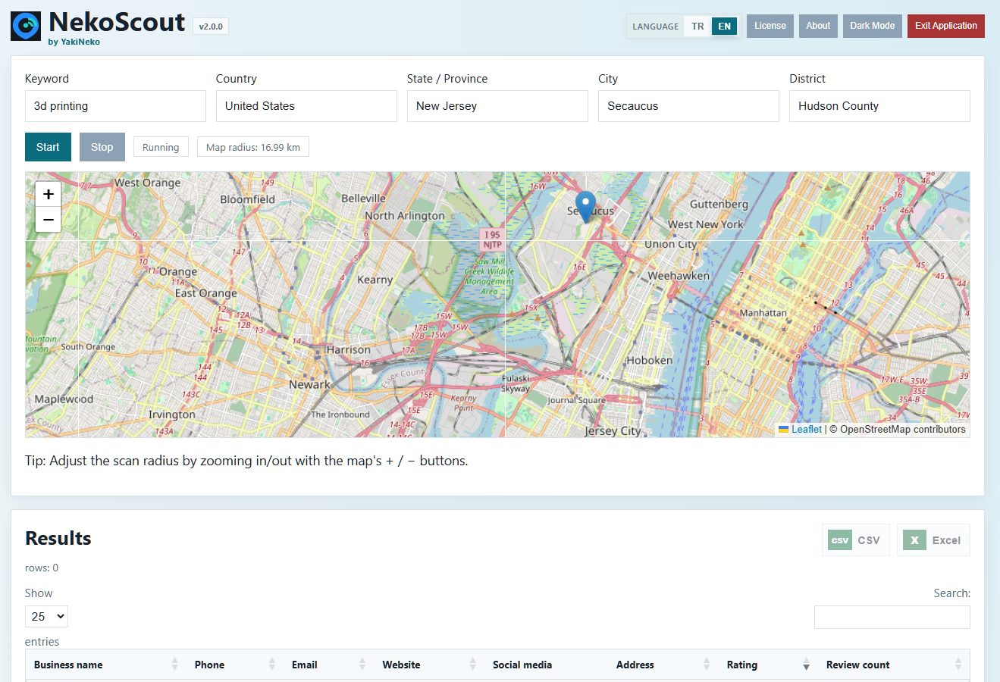
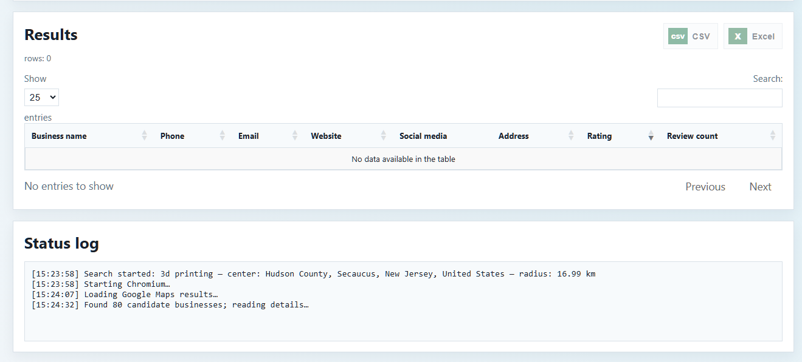

# NekoScout 2.0

NekoScout is a Windows desktop tool for map-centered local business research and CSV/Excel export.

## Screenshots

## Trial

The free trial lasts 7 days or 10 searches, whichever comes first. A paid license permits perpetual use on one device.

## Installation

[Download NekoScout Setup 2.0.0](https://github.com/Bigwawe/NekoScout/releases/download/v2.0.0-public-preview/NekoScout-Setup-2.0.0.exe), verify its SHA-256 value against [`SHA256SUMS.txt`](https://github.com/Bigwawe/NekoScout/releases/download/v2.0.0-public-preview/SHA256SUMS.txt), then run the installer.

The installer is not currently code-signed, so Windows SmartScreen may display an “Unknown publisher” warning.

## Support and licensing

Email [nekoscout.support@gmail.com](mailto:nekoscout.support@gmail.com). For a device-bound license, include the Device ID displayed in NekoScout’s License panel.

## Responsible use

Users are responsible for complying with applicable laws, platform terms, privacy rules, and electronic marketing requirements. Do not use NekoScout for spam, harassment, unlawful data processing, or unauthorized marketing.

NekoScout is not affiliated with or endorsed by Google.
